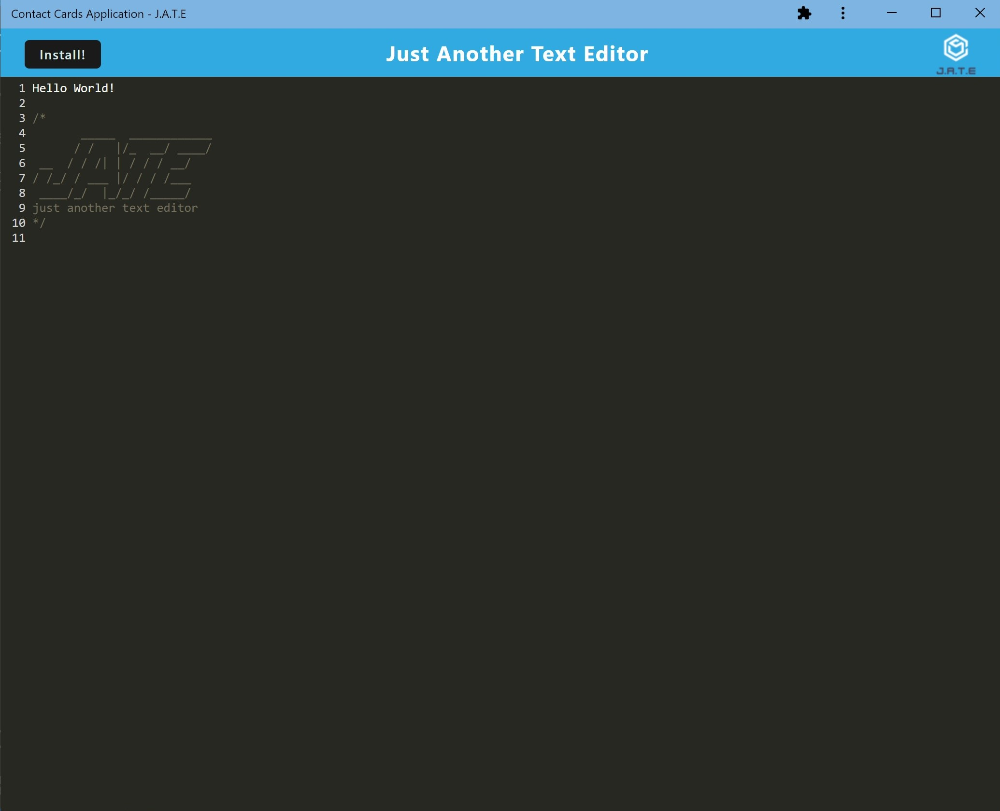
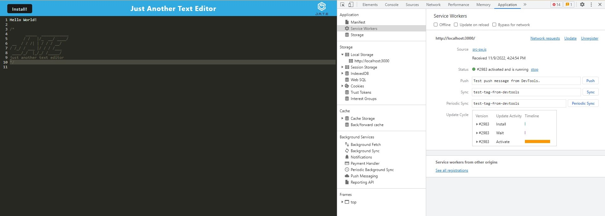
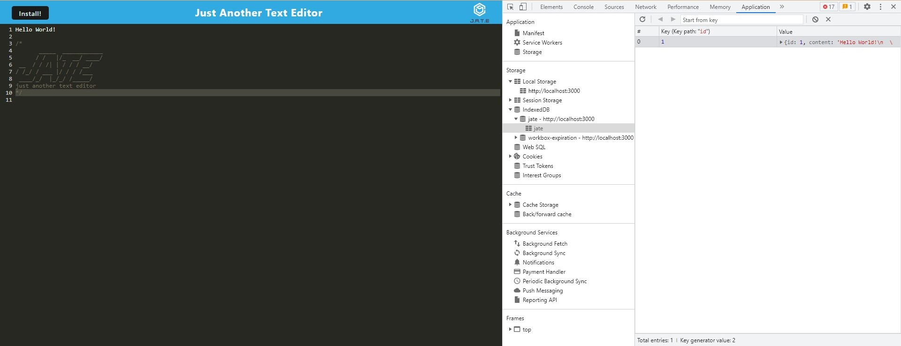

# Text Editor

## Tools Used:
- JavaScript
- Node.js
- PWA (Progressive Web Applications)
- Service workers

## Visuals:

- MockUp

- This shows the application's registered service worker.

- This shows the application's IndexedDB storage.

## Table of Contents:
* [Tools Used](#tools-used)
* [Visuals](#visuals)
* [Description](#description)
* [Heroku](#heroku-link)
* [Installation](#installation)
* [Tests](#tests)
* [Contributing](#contributing)
* [License](#license)
* [Information Contacts](#information-contacts)

## Description:
- This application allows to create notes or code snippets with or without an internet connection.

## Heroku Link:
- https://tiffyalva-pwa-text-editor.herokuapp.com/

## Installation:
- Run, <b>"npm start"</b> from root directory.

## Tests:
- N/A

## Contributing: 
- N/A

## License:

## Information Contacts:
* GitHub Username: <a href="https://github.com/TiffyAlva">TiffyAlva</a>
* Email: <a href="malito:TiffanyAlvarez54@gmail.com">TiffanyAlvarez54@gmail.com